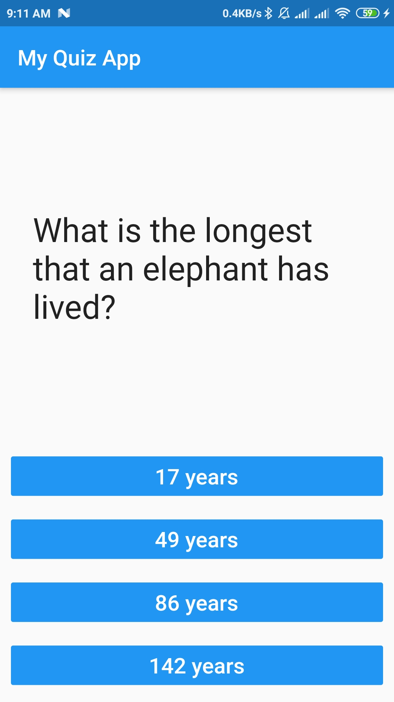
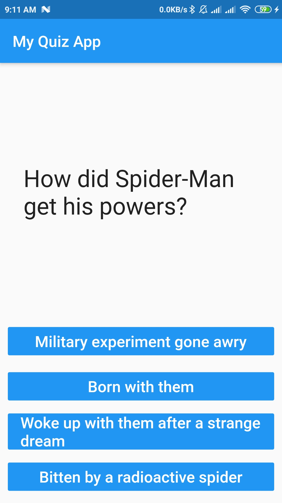
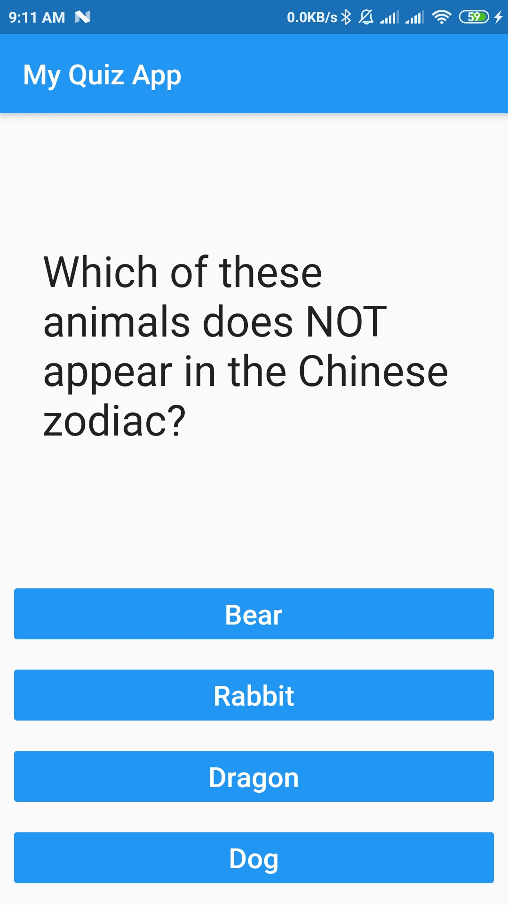

# ans_qstn_app

### You should have fun while learning. That's why I added some fun questions to make my work more interesting.

## Here are some of the screenshots
### Screenshot 1

### Screenshot 2

### Screenshot 3

